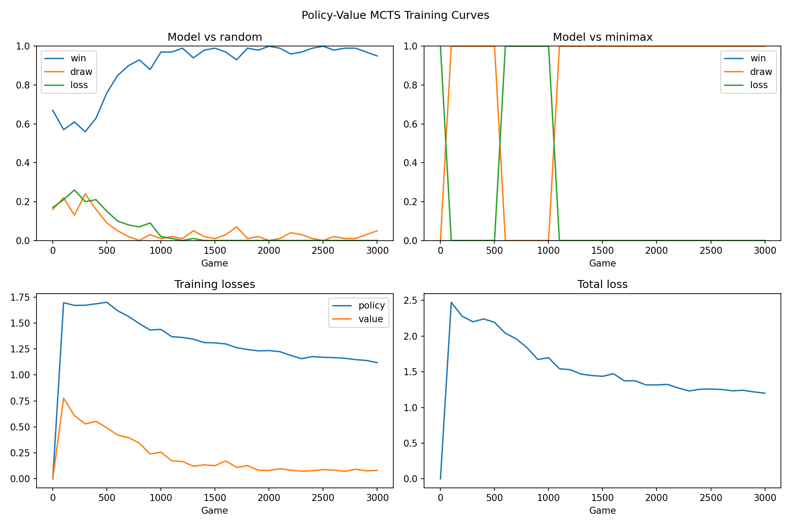

# Tic-Tac-Toe Policy-Value MCTS

This project trains a tic-tac-toe agent with a **policy + value neural network** and **Monte Carlo Tree Search (MCTS)**, with optional **minimax expert pretraining** and metrics in `output/metrics.csv`.

## Purpose

This project demonstrates DeepMind-style game AI at tic-tac-toe scale. A **policy + value network** guides Monte Carlo Tree Search (MCTS). The agent can learn from optional minimax expert pretraining and from self-play games without human data or hand-coded tactics. Evaluation against random and perfect minimax opponents tracks progress in `output/metrics.csv` and `output/learning_curves.png`.

## Install

```bash
python -m venv .venv
source .venv/bin/activate
pip install -e .
```

Optional development tools:

```bash
pip install -e ".[dev]"
```

## Train

```bash
tic-tac-toe-train
```

Training writes to `output/` in the project root (printed at startup as `Writing outputs to ...`). Metrics and plots update every `eval_every` games.

| File | Description |
|------|-------------|
| `output/model.pt` | Final checkpoint |
| `output/best_model.pt` | Best checkpoint by eval score (`draw_minimax − loss_minimax + 0.5 × win_random`) |
| `output/metrics.csv` | Learning metrics at regular intervals |
| `output/learning_curves.png` | Plots of win/draw/loss rates and training losses |

### `config.py` defaults

Edit `config.py` to change hyperparameters. All fields on `TrainConfig`:

| Setting | Default | Role |
|---------|---------|------|
| `seed` | 42 | Random seed for NumPy, PyTorch, and sampling |
| `num_episodes` | 3000 | Self-play games after optional pretrain |
| `expert_sample_ratio` | 0.0 | Fraction of minimax-labeled positions for pretrain (0 skips pretrain) |
| `pretrain_epochs` | 200 | Expert pretrain epochs |
| `pretrain_policy_weight` | 2.0 | Policy loss weight during pretrain |
| `pretrain_batch_size` | 32 | Pretrain batch size |
| `pretrain_learning_rate` | 1e-3 | Pretrain Adam learning rate |
| `mcts_simulations` | 15 | MCTS simulations per move during self-play |
| `mcts_eval_simulations` | 0 | MCTS simulations during eval (0 uses network policy only) |
| `mcts_play_simulations` | 0 | MCTS simulations in GUI/CLI play (0 uses network policy; set >0 and retrain to save in checkpoint) |
| `c_puct` | 1.25 | MCTS exploration constant |
| `replay_size` | 1000 | Replay buffer capacity |
| `batch_size` | 32 | Self-play training batch size |
| `learning_rate` | 1e-3 | Self-play Adam learning rate |
| `train_steps_per_game` | 1 | Gradient steps after each self-play game |
| `temperature_moves` | 2 | First N agent moves sample from MCTS policy (exploration) |
| `symmetry_augment` | True | 8-fold board symmetry augmentation |
| `warmup_episodes` | 0 | Episodes vs random before self-play |
| `opponent_game_ratio` | 0.1 | Fraction of games vs random instead of self-play |
| `eval_every` | 100 | Record metrics every N self-play games |
| `eval_games` | 100 | Games per random/minimax eval batch |
| `rolling_window` | 100 | Window for logged training loss and reward |
| `hidden_dim` | 128 | Policy-value network width |
| `grad_clip` | 1.0 | Gradient norm clip |
| `ema_decay` | 0.999 | EMA decay for inference network |
| `early_stop_evals` | 10000 | Stop if eval score does not improve for this many evals |
| `revert_on_regression` | False | Reload `best_model.pt` when eval score drops |

## Play

After training:

```bash
tic-tac-toe-play
```

This opens a graphical board. With the default `mcts_play_simulations=0`, the agent uses the trained network policy only. Set `mcts_play_simulations` in `config.py` and retrain so the checkpoint stores a nonzero play-time search budget.

Terminal mode:

```bash
tic-tac-toe-play-cli
```

## Metrics

Each row in `output/metrics.csv` is recorded every `eval_every` self-play games (100 by default).

| Column | Meaning |
|--------|---------|
| `episode` | Self-play game index (0 is the post-pretrain baseline eval) |
| `train_reward_mean` | Mean self-play outcome over the rolling window (+1 win, 0 draw, −1 loss for the agent) |
| `policy_loss_mean` | Cross-entropy vs MCTS visit distribution |
| `value_loss_mean` | MSE vs game outcome (+1 win, 0 draw, −1 loss for the player to move) |
| `total_loss_mean` | Policy + value loss |
| `win_rate_random` | Win rate vs random opponent |
| `draw_rate_random` | Draw rate vs random opponent |
| `loss_rate_random` | Loss rate vs random opponent |
| `win_rate_minimax` | Win rate vs perfect minimax |
| `draw_rate_minimax` | Draw rate vs perfect minimax (should rise toward 1.0) |
| `loss_rate_minimax` | Loss rate vs minimax (should fall toward 0.0) |

**What good learning looks like**

- `draw_rate_minimax` climbs toward **80–100%**
- `loss_rate_minimax` falls toward **0%**
- `win_rate_random` climbs toward **95–100%** and `draw_rate_random` / `loss_rate_random` fall toward **0%**
- In the GUI, the agent blocks two-in-a-row threats consistently

## How policy-value MCTS training works

### Board input vs value output

The network uses two different +1 / 0 / −1 scales.

**Board input**: Nine numbers, one per cell, from the **current player’s** point of view:

| Value | Meaning |
|-------|---------|
| **+1** | Current player’s mark (X or O) |
| **−1** | Opponent’s mark |
| **0** | Empty cell |

**Value output and training labels**: One number for how the game ends **for the current player**:

| Value | Meaning |
|-------|---------|
| **+1** | Win |
| **0** | Draw |
| **−1** | Loss |

The value head predicts the second scale. Self-play rewards, expert labels, and `value_loss_mean` all use it.

### Policy + value network

The network reads the 9-cell board encoding above and outputs:

- **Policy** $p(a|s)$: Prior over legal moves
- **Value** $V(s)$: Expected outcome for the current player on the win / draw / loss scale above

### MCTS

At each move, MCTS runs many simulations:

1. **Select** promising moves (UCB + policy prior)
2. **Expand** a new leaf using the policy network
3. **Evaluate** the leaf with the value network
4. **Backup** results up the tree

The move with the most visits is played. At play time this gives lookahead without hand-coded rules.

### Training

Each self-play game produces $(s, \pi_{MCTS}, z)$ examples:

- $\pi_{MCTS}$: MCTS visit distribution (improved policy target)
- $z$: Final game outcome for the player who was to move in state $s$ (+1 win, 0 draw, −1 loss)

Loss:

$$
L = -\sum_a \pi_{MCTS}(a) \log p_\theta(a|s) + (V_\theta(s) - z)^2
$$

**Symmetry augmentation** (8 board rotations/reflections) multiplies training data without extra rules.

## Results

The plots in `output/learning_curves.png` and rows in `output/metrics.csv` are from the latest run with current `config.py` defaults: **3,000** self-play games, `seed=42`, `eval_every=100`, `expert_sample_ratio=0` (no pretrain), `mcts_simulations=15`, and `mcts_eval_simulations=0`.



### Performance over training

| Phase | Win vs random | Draw vs random | Loss vs random | Draw vs minimax | Loss vs minimax |
|-------|---------------|----------------|----------------|-----------------|-----------------|
| Start (game 0) | 67% | 16% | 17% | 0% | 100% |
| Mid (game 500) | 76% | 9% | 15% | **100%** | 0% |
| Late (game 1200) | **99%** | 1% | 0% | **100%** | 0% |
| Final (game 3000) | 95% | 5% | 0% | **100%** | **0%** |

Against random, the agent reaches high win rates by mid-training and keeps `loss_rate_random` near zero at the end. Against perfect minimax, `draw_rate_minimax` is already **100%** by game 100 in this run; there is a brief regression around games 600–1000 where `loss_rate_minimax` spikes again before stabilizing. A draw against perfect play is the best possible outcome at tic-tac-toe scale.

### Loss curves

Training losses fall over self-play (game 100 → game 3000):

- **Policy loss**: ~1.70 → ~1.12
- **Value loss**: ~0.78 → ~0.08
- **Total loss**: ~2.47 → ~1.20

The value head converges faster than the policy head because win / draw / loss labels (+1 / 0 / −1) are a simpler target than full MCTS visit distributions.

### What the curves mean

- A rising `draw_rate_minimax` toward 1.0 means the agent stops losing to perfect play.
- High `win_rate_random` with low `draw_rate_random` and `loss_rate_random` means the agent wins cleanly against weak play.
- Flat or slowly falling `total_loss_mean` during self-play is normal when MCTS targets keep improving.

With **expert pretraining** (`expert_sample_ratio > 0`), game 0 typically already draws vs minimax; self-play then mainly refines estimates.

## Improvement process

Getting learning to work required both design changes and debugging. Main architectural and algorithmic improvements are listed below.

### DQN → policy-value MCTS

The first version used a Q-network with epsilon-greedy moves. It struggled to learn reliable blocking and winning — value-based action selection on a tiny board still spreads credit assignment across many similar states.

The current design follows the AlphaZero pattern:

- One network outputs **policy** (move priors) and **value** (expected outcome)
- **MCTS** uses those outputs to search ahead at train and play time
- Training targets come from **MCTS visit counts** (a stronger policy than the raw network) and **game outcomes** (value labels)

Search amplifies a weak network into better move choices, and self-play generates improved targets over time. That coupling is the main reason performance improved over plain DQN.

### Expert pretraining

Before self-play, the agent can train on positions labeled by a perfect minimax solver (~4,500 reachable boards). Each example provides:

- A **policy target** derived from optimal play (prioritizing immediate wins and blocks)
- A **value target** on the outcome scale (+1 win, 0 draw, −1 loss) from the solver

This bootstraps tactics that self-play alone takes many games to discover. With `expert_sample_ratio > 0`, the agent already draws vs minimax after pretrain; self-play then refines estimates rather than learning basics from scratch.

### Self-play and checkpointing

Self-play is not always monotonic improvement. The MCTS target policy shifts as search improves, and replay can overwrite good weights with worse ones. The training loop therefore tracks a **best checkpoint** by eval score (`draw_minimax − loss_minimax + 0.5 × win_random`), can **revert** to that checkpoint when eval regresses if `revert_on_regression=True`, and supports pretrain-only runs with `num_episodes=0`.

Treat self-play as refinement on top of a solid baseline, not the only source of learning signal.

### Bug fixes

Some implementation bugs obscured the design, including wrong minimax labels during expert pretraining of the value head. After those issues were fixed, the architectural choices above drove stable learning and improvements.

## Development

```bash
ruff check .
ruff format .
```
